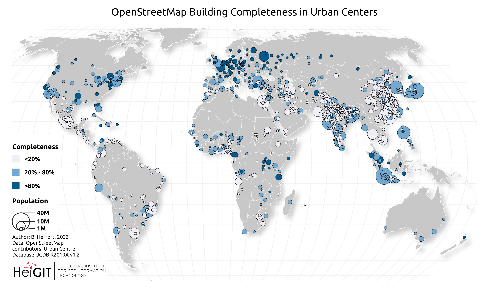

# awesome-science-maps
🗺️ Awesome lists about all maps in journals and science 

	
	 

A curated list of awesome maps from science journals and others sources.

## Contents

- [awesome-science-maps](#awesome-science-maps)
  - [Contents](#contents)
  - [Open Street Maps](#open-street-maps)
  - [Sattelite Maps](#sattelite-maps)
  - [Tutorials](#tutorials)

_______

## Open Street Maps

	
	 

Spatial distribution of OSM building completeness in 13,189 urban centers. For each class the overall number of urban centers is reported in the squared bracket. For an interactive web map visualization visit https://hex.ohsome.org/#/urban_building_completeness. OSM data as of 2023-01-01. Created using QGIS 3.28.3 (https://www.qgis.org/en/site/). Paper - https://doi.org/10.1038/s41467-023-39698-6

## Sattelite Maps

## Tutorials